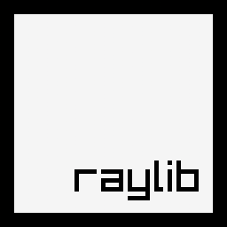

  

[](https://discord.gg/tPWjMwK) [](https://twitter.com/tinyBigGAMES)
# raylib
### A simple and easy-to-use library to enjoy videogames programming

Pascal bindings that allow you to use **raylib** and other useful libraries with <a href="https://www.embarcadero.com/es/products/delphi" target="_blank">Delphi</a>. 

### Included
- **raylib** (https://github.com/raysan5/raylib)

### Minimum Requirements 
- Windows 10+ (64 bits)
- <a href="https://www.embarcadero.com/products/delphi/starter" target="_blank">Delphi Community Edition</a> (Win64 platform only)

### Usage
You simply add `raylib` to your uses section and everything will be linked in your executable, ready for use with no DLLs to maintain. You will have direct access to all the aforementioned libraries.

```Pascal
uses
  System.SysUtils,
  raylib;

const
  screenWidth = 800;
  screenHeight = 450;

begin
  InitWindow(screenWidth, screenHeight, 'raylib [core] example - basic window');
  while not WindowShouldClose do
  begin
    BeginDrawing;
      ClearBackground(RAYWHITE);
      DrawText('Congrats! You created your first window!', 190, 200, 20, LIGHTGRAY);
    EndDrawing;
  end;
  CloseWindow;
end.
```


### Support
- <a href="https://github.com/tinyBigGAMES/raylib/issues" target="_blank">Issues</a>
- <a href="https://github.com/tinyBigGAMES/raylib/projects/1" target="_blank">Issue Tracking</a>
- <a href="https://github.com/tinyBigGAMES/raylib/discussions" target="_blank">Discussions</a>
- <a href="https://github.com/tinyBigGAMES/raylib/wiki" target="_blank">Wiki</a>
- <a href="https://tinybiggames.com/contact/" target="_blank">Contact</a>
- <a href="https://raylib.com/" target="_blank">raylib website</a>
- <a href="https://github.com/raysan5/raylib/wiki/" target="_blank">raylib wiki</a>
- <a href="https://www.raylib.com/cheatsheet/cheatsheet.html" target="_blank">raylib cheatsheet</a>
- <a href="https://www.raylib.com/examples.html" target="_blank">raylib examples</a>
- <a href="https://github.com/raysan5/raylib/discussions" target="_blank">raylib discussions</a>
- <a href="https://www.youtube.com/results?search_query=raylib&sp=CAI%253D" target="_blank">raylib on YouTube</a>


<p align="center">

</p>
<h5 align="center">

Made with :heart: in Delphi
</h5>